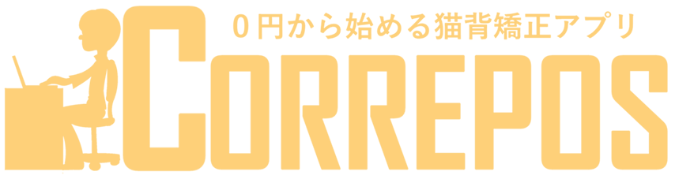

====
CORREPOSは猫背を治したいPCユーザ向けの姿勢矯正アプリケーションです．

## Description
　PCユーザの皆さん，作業中についつい猫背になっていませんか？猫背は肩凝りや腰痛の原因となります．私たちは猫背を治したいPCユーザの皆さんのためにCORREPOSを製作しました．必要なものはカメラ付きのPCのみです．
　CORREPOSは猫背を検知しそれを警告することで，無理なく手軽に猫背を矯正することができるアプリです．
　CORREPOSは矯正器具と異なり，0円から始めることが可能です．また，既存のアプリと異なり，アバター表示や猫背ログ，Twitter連携などユーザに姿勢矯正を促す多彩な機能を備えています．
　CORREPOSは常に画面の最前面に表示されるため，作業しながらでもメインウィンドウを確認することができます．このウィンドウは小さいためあまり場所を取りません．また，最小化してもバルーンと音声による通知が行われます．
　CORREPOSでは，まずカメラでユーザの正しい姿勢を登録し，その時の顔の位置と現在の顔の位置を比較することで猫背を判定しています．　ユーザが猫背の間猫背ゲージが増加し，ゲージが最大になると猫背の通知が行われます．この猫背ゲージ増加の速度や猫背判定の厳しさは調整することが可能です．

***DEMO:***

## Usage
1. 以下のサイトから実行ファイルをダウンロードします．
2. 「START」をクリックし基準となる正しい姿勢を撮影します．
3. 撮影が完了したら「次へ」をクリックします．
4. メインウィンドウが現れ猫背検出が始まります．
※メインウィンドウのボタンは上から，姿勢の再登録，設定，ログ表示のウィンドウを表します．

## Requirement
* Python 3.5  
* OpenCV 3.1.0

## Installation
    $ git clone https://github.com/achutane/correpos_1.0
